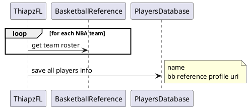
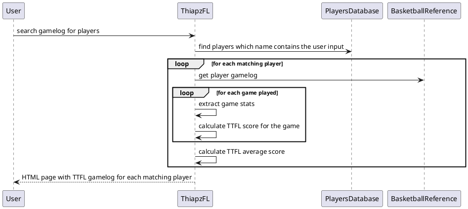
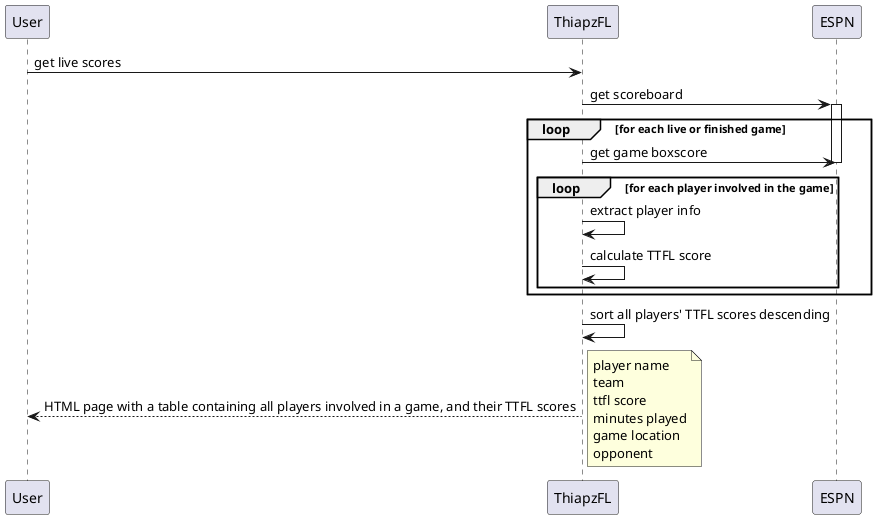

# Thiapathioly ES Fantasy League (TEFL)

## Use cases

- save players to database (one-time thing)

- get gamelog for player with TTFL scores

- get live TTFL scores

### Top TTFL averages
- for each player, calculate TTFL average
- sort and display as a list, for each element:
    - player name
    - player TTFL average

### TTFL scores of a player against a team for the two-three last years

