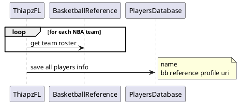
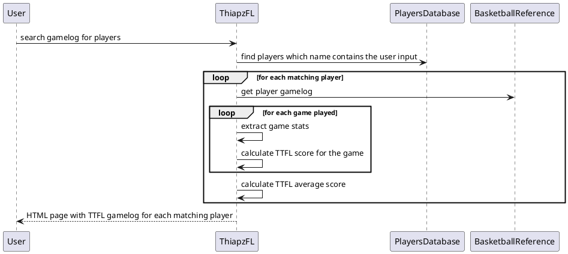
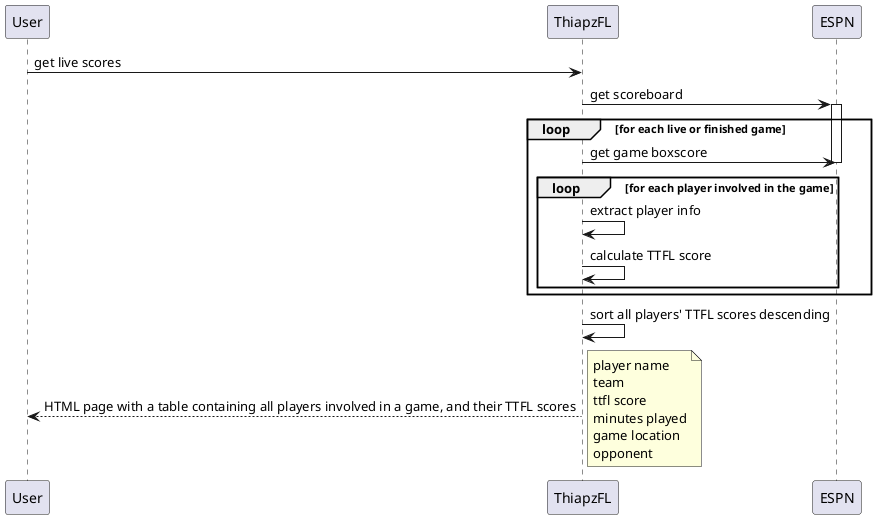

# Thiapathioly ES Fantasy League (TEFL)

## Use cases

- save players to database (one-time thing)

- get gamelog for player with TTFL scores

- get live TTFL scores

### Top TTFL averages
- for each player, calculate TTFL average
- sort and display as a list, for each element:
    - player name
    - player TTFL average

### Injury report of a team

if __name__ == '__main__':
    today = datetime.now().strftime("%Y%m%d")
    tomorrow = datetime.now().strftime("%Y%m%d")

### TTFL scores of a player against a team for the two-three last years

    scoreboard_page = BeautifulSoup(requests.get(f"https://www.espn.com/nba/scoreboard").text, "html.parser")
    games = scoreboard_page.select("div[class~=ScoreboardScoreCell] ul[class~=ScoreboardScoreCell__Competitors]")
    team_names = [g.select("div[class~=ScoreCell__TeamName]") for g in games]
    competitors = [(home, away) for home, away in team_names]

    injuries_page = BeautifulSoup(requests.get(f"https://www.espn.com/nba/injuries").text, "html.parser")

    injuries_per_team = injuries_page.select("div[class~=Table__league-injuries]")

    team_injuries = injuries_per_team[0]

    team_name = team_injuries.select_one("div[class~=Table__Title] span[class~=injuries__teamName]").text

    players = team_injuries.select("tbody > tr")

    first_player = players[0]

    print(first_player.select_one("td[class~=col-name] > a").text)
    print(first_player.select_one("td[class~=col-stat] > span").text)
    print(first_player.select_one("td[class~=col-desc]").text)

    session: HTMLSession = HTMLSession()
    r = session.get("https://www.espn.com/nba/scoreboard")

    r.html.render()
    print(r.html.search('
{}
'))

    #print([(home.text, away.text) for home, away in competitors])

    #self.entries = sorted(entries, key=lambda entry: entry.date, reverse=True)

